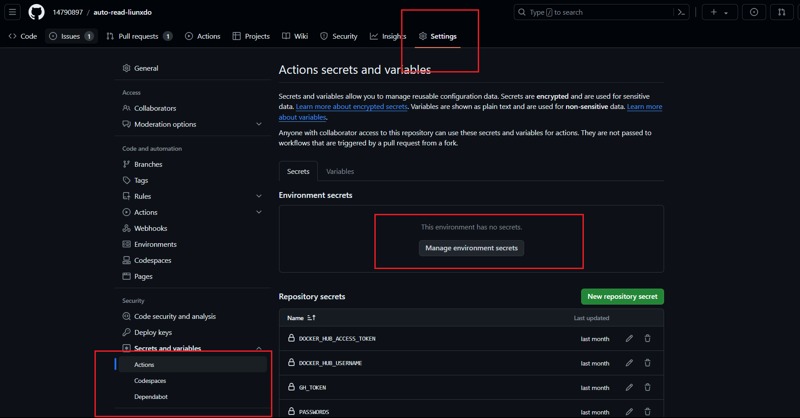

[英文文档](./README_en.md)
### 
新的依赖不能显示脚本运行日志了，只显示网页的429日志

## 使用方法一：油猴脚本(火狐不兼容,谷歌可以用)

油猴脚本代码在 index 开头的文件 中，建议在使用前将浏览器页面缩小，这样子可以一次滚动更多页面，读更多的回复
油猴脚本安装地址：

1. https://greasyfork.org/en/scripts/489464-auto-read 自动阅读随机点赞
2. https://greasyfork.org/en/scripts/506371-auto-like-specific-user 基于搜索到的帖子自动点赞特定用户
3. https://greasyfork.org/zh-CN/scripts/506567-auto-like-specific-user-base-on-activity 基于用户的活动自动点赞特定用户

## 使用方法二：本地运行（Windows 默认有头浏览器，Linux 默认无头浏览器）

### 1.设置环境变量

.env 里面设置用户名 密码 以及其它 env 里面指明的信息

### 2.运行

#### Windows

```sh
npm install
# 自动阅读随机点赞
node .\bypasscf.js
# 自动点赞特定用户
## windows
set LIKE_SPECIFIC_USER=true && node .\bypasscf.js
## powershell
$env:LIKE_SPECIFIC_USER = "true"
node .\bypasscf.js
## linux
LIKE_SPECIFIC_USER=true node ./bypasscf.js
```

#### Linux 额外安装以下包，运行命令相同

```sh
sudo apt update
wget -qO- https://deb.nodesource.com/setup_20.x | sudo -E bash - #安装node的最新源
sudo apt install nodejs  -y
sudo apt install -y wget unzip fontconfig locales gconf-service libasound2 libatk1.0-0 libc6 libcairo2 libcups2 libdbus-1-3 libexpat1 libfontconfig1 libgcc1 libgconf-2-4 libgdk-pixbuf2.0-0 libglib2.0-0 libgtk-3-0 libnspr4 libpango-1.0-0 libpangocairo-1.0-0 libstdc++6 libx11-6 libx11-xcb1 libxcb1 libxcomposite1 libxcursor1 libxdamage1 libxext6 libxfixes3 libxi6 libxrandr2 libxrender1 libxss1 libxtst6 ca-certificates fonts-liberation libappindicator1 libnss3 lsb-release xdg-utils wget xvfb
sudo snap install chromium

```

```sh
npm install
# 自动阅读随机点赞
node .\bypasscf.js
# 自动点赞特定用户
node .\bypasscf_likeUser.js
```

## 使用方法三：GitHub Action 每天 4 点阅读

#### 说明： 每天运行，每次二十分钟(可自行修改启动时间和持续时间，代码.github\workflows\cron_bypassCF.yaml 和 .github\workflows\cron_bypassCF_likeUser.yaml)

### 1. fork 仓库

### 2.设置环境变量

在 GitHub action 的 secrets 设置用户名密码（变量名参考.env 中给出的），这里无法读取.env 变量


### 3.启动 workflow

教程：https://github.com/ChatGPTNextWeb/ChatGPT-Next-Web?tab=readme-ov-file#enable-automatic-updates

## 使用方法四：docker 运行

### 1.立刻执行

克隆仓库，在`docker-compose.yml`里面设置环境变量，然后运行

```sh
# 自动阅读随机点赞
 docker-compose up -d
 # 自动点赞特定用户
 docker-compose -f docker-compose-like-user.yml up -d
```

查看日志

```sh
docker-compose logs -f
```

### 2.定时运行

```sh
chmod +x cron.sh

crontab -e
```

手动添加以下内容(功能是每天六点执行)

```sh
0 6 * * *  /root/auto-read-liunxdo/cron.sh  # 注意这是示例目录，要改为所在仓库目录的cron.sh（使用pwd查看所在目录）
```

## 如何增加基于 discourse 的其它网站的支持？

1. 修改 index_passage_list 中的// @match ，根据其它示例网站，填写新的 url，此外在脚本开头的 possibleBaseURLs 中也添加 url
2. 服务器运行时，还需要修改.env 下的 WEBSITE 变量为对应的网址（如果网址是不存在原先脚本的，需要修改 external.js 中对应的部分，重新构建镜像）
3. 小众软件论坛只能在 Windows 下运行，所以需要使用定制版 action: [.github\workflows\windows_cron_bypassCF.yaml](https://github.com/14790897/auto-read-liunxdo/blob/main/.github/workflows/windows_cron_bypassCF.yaml)

#### 其它

external 是作为 puppeteer 的脚本使用的，由 index_passage_list.js 改造，主要是去除了按钮以及设置为自动阅读和自动点赞启动

```sh
   localStorage.setItem("read", "true"); // 自动滚动
    localStorage.setItem("autoLikeEnabled", "true"); //自动点赞

      // document.body.appendChild(button);
  // document.body.appendChild(toggleAutoLikeButton);
```

#### 随笔

开发中遇到的问题：
问：TimeoutError: Navigation timeout of 30000 ms exceeded 为什么 puppeteer 经常出现这个错误?
答：linux 使用{waitUntil: 'domcontentloaded'}后，情况大大好转，但还是有时出现，Windows 未曾出现此问题 [见文章分析](随笔.md)

这个也可能是因为登陆太频繁导致的，太快的登陆太多的账号

更少见的情况其实是密码错误

#### 待做

1. TimeoutError 时候可以捕获错误然后关掉当前浏览器重新再开一次
2. 自动阅读脚本可以加一个阅读速度选项（快，慢，始终），因为有用户反应读的太快了（应该是他们屏幕太小）
3. https://github.com/14790897/auto-read-liunxdo/issues/67

## 感谢

https://linux.do/t/topic/106471

#### 使用 index_likeUser 点赞记录

9.2 handsome
9.3 lwyt
9.4 hindex
9.5 endercat
9.6 mrliushaopu
9.6 MonsterKing
9.7 zhiyang
9.8 xibalama
9.9 seeyourface LangYnn
9.10 YYWD
9.11 zhong_little
9.12 LangYnn
9.13 YYWD
9.14 wii
9.15 RunningSnail
9.16 ll0， mojihua，ywxh
9.17 GlycoProtein
9.18 Clarke.L Vyvx
9.19 azrael
9.20 Philippa shenchong
9.21lllyz hwang
9.22 include Unique
9.24 taobug
9.25 CoolMan
9.26 Madara jonty
9.27 jonty(不小心点了两次)
9.29 haoc louis miku8miku
9.30 horrZzz zxcv
10.1 bbb
10.2 zyzcom
10.4 jeff0319 Game0526 LeoMeng
10.5 kobe1 pangbaibai
10.6 xfgb lentikr
10.7 PlayMcBKuwu Tim88
10.10 elfmaid
10.11 yu_sheng orxvan l444736 time-wanderer
10.14 time-wanderer OrangeQiu
Timmy_0
SINOPEC
onePiece HelShiJiasi delph1s

<!--
代码：
https://github.com/14790897/auto-read-liunxdo
## 手动运行

### 1.设置环境变量

.env 里面设置用户名 密码

### 2.运行


```sh

npm install

node .\bypasscf.js

```
## GitHub Action 每天 阅读

(可自行修改启动时间和持续时间，代码.github\workflows\cron_bypassCF.yaml)

### 1. fork 仓库

### 2.设置环境变量

在 GitHub action 的 secrets 设置用户名密码（变量名参考.env 中给出的）（.env 里面设置用户名密码在这里无效）


### 3.启动 workflow

教程：https://github.com/ChatGPTNextWeb/ChatGPT-Next-Web?tab=readme-ov-file#enable-automatic-updates

## 演示视频
<iframe src="//player.bilibili.com/player.html?isOutside=true&aid=112902946161711&bvid=BV1QLiceMExQ&cid=500001637992386&p=1" scrolling="no" border="0" frameborder="no" framespacing="0" allowfullscreen="true"></iframe> -->
